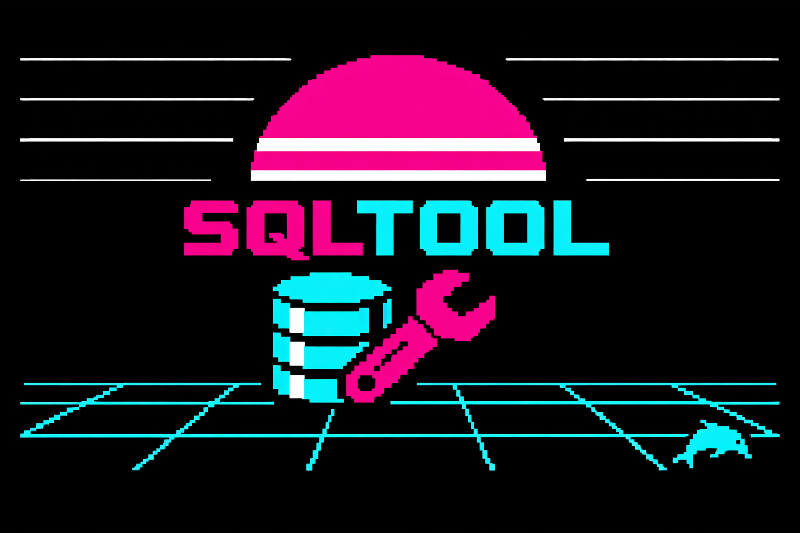

<p align="center">
  
</p>

# sqltool

Local MySQL/MariaDB instance manager for development. No containers, no systemd services - just isolated database instances that run when you need them.

## Features

- **No containers** - runs mysqld directly as your user
- **Isolated instances** - each project gets its own data directory, socket, port, and logs
- **No auto-start** - databases only run when you start them
- **Multi-distro support** - auto-detects your distro and installs MariaDB if needed
- **Simple workflow** - add, start, stop, backup, restore, clone

## Requirements

- MariaDB or MySQL (auto-installed if missing)
- **Perl version**: Perl 5 (pre-installed on most systems)
- **Nim version**: Nim 1.6+ (to build from source)

## Installation

### Build from source (Nim)

Requires [Nim](https://nim-lang.org/install.html) 1.6 or later.

```bash
git clone https://github.com/lucianofedericopereira/sqltool.git
cd sqltool
make build         # native binary
make strip         # strip debug symbols (~172KB)
sudo make install  # install to /usr/local/bin
```

Or directly with the Nim compiler:

```bash
nim c -d:release --opt:size nsqltool.nim
```

#### Cross-compilation targets

| Target | Command | Requirement |
|--------|---------|-------------|
| Linux x86_64 (static) | `make linux-static` | `musl-tools` |
| Linux ARM64 | `make linux-arm64` | `gcc-aarch64-linux-gnu` |
| macOS ARM64 | `make macos-arm64` | compile on macOS |
| macOS x86_64 | `make macos-x86` | compile on macOS |

### Perl version (no build step)

```bash
git clone https://github.com/lucianofedericopereira/sqltool.git
cd sqltool
chmod +x sqltool
sudo cp sqltool /usr/local/bin/sqltool
```

### macOS (Homebrew)

```bash
brew tap lucianofedericopereira/sqltool
brew install sqltool
```

## Quick Demo

Run the included demo script to see sqltool in action:

```bash
./tryme.sh
```

This will:
1. Create a test instance called `demo`
2. Start it
3. Create a sample table with data
4. Make a backup
5. Stop the instance

After the demo, clean up with `./sqltool remove demo`.

## Usage

```bash
# Create a new database instance
sqltool add myproject

# Start it
sqltool start myproject

# Connect
mysql -u myproject -p -S ~/sql/myproject/data/mysql.sock
# or via TCP
mysql -u myproject -p -h 127.0.0.1 -P 3307

# Stop when done
sqltool stop myproject

# See all instances
sqltool list
```

## Commands

| Command | Description |
|---------|-------------|
| `add <project>` | Create new database instance |
| `remove <project>` | Delete instance and all data |
| `start <project>` | Start instance |
| `stop <project>` | Stop instance |
| `list` | List all instances |
| `info <project>` | Show instance details |
| `port <project>` | Show port number |
| `logs <project>` | Show recent error logs |
| `backup <project>` | Create SQL backup |
| `restore <project> <file.sql>` | Restore from backup |
| `clone <src> <dst>` | Clone an instance |
| `status <project>` | Quick status check |
| `help` | Show help |

## Directory Structure

All data is stored in `~/sql/`:

```
~/sql/
├── myproject/
│   ├── data/          # MySQL data files
│   │   └── mysql.sock # Unix socket
│   ├── etc/
│   │   └── my.cnf     # Instance config
│   ├── logs/
│   │   └── error.log  # Error log
│   └── scripts/
│       ├── start      # Start script
│       └── stop       # Stop script
├── anotherproject/
│   └── ...
└── backups/           # SQL backups
```

## Supported Systems

Auto-detection and installation works on:

- **macOS**: via Homebrew (Apple Silicon and Intel)
- **Debian/Ubuntu** family: Debian, Ubuntu, Linux Mint, Pop!_OS, elementary OS
- **Red Hat** family: Fedora, RHEL, CentOS, Rocky Linux, AlmaLinux
- **Arch** family: Arch Linux, Manjaro
- **SUSE** family: openSUSE, SUSE
- **Others**: Void Linux, Alpine Linux

For other systems, install MariaDB manually first.

## Why Perl?

Perl is the right tool for this job:

- **Pre-installed everywhere** - available on virtually every GNU/Linux system out of the box, from Debian to Arch to Alpine
- **No setup required** - no `pip install`, no `npm install`, no `cargo build`, no virtual environments, no dependency hell
- **Uses only core modules** - File::Path, File::Basename, POSIX are part of Perl's standard library since forever
- **Single file distribution** - copy one file, make it executable, done
- **Battle-tested stability** - Perl scripts written 20 years ago still run today without modification
- **Fast startup** - instant execution, no JIT warm-up, no interpreter initialization overhead
- **Excellent for system tasks** - process management, file operations, and text processing are Perl's bread and butter

### The Unix tradition

Perl follows the Unix philosophy that shaped GNU/Linux: small, focused tools that do one thing well. Like `grep`, `awk`, and `sed` before it, Perl was designed for text processing and system administration - the same tasks this tool performs.

Classic sysadmin tools have always been scripts:
- `autoconf`, `automake` - Perl and shell
- `git-send-email` - Perl
- `debhelper` - Perl
- Countless system utilities in `/usr/bin` - Perl, shell, awk

This isn't legacy - it's proven engineering. These tools have managed millions of servers for decades. Perl is part of the GNU/Linux ecosystem in a way that newer languages simply aren't.

### Why this matters today

In 2026, installing a simple CLI tool often means:
- Python: create venv, pip install dependencies, hope nothing conflicts with system Python
- Node: npm install, node_modules bloat, version conflicts
- Rust/Go: compile step, or trust pre-built binaries

With Perl:
```bash
chmod +x sqltool
./sqltool add myproject
```

That's it. Works on a fresh Debian install. Works on a minimal Alpine container. Works on your colleague's Fedora laptop. No `pyproject.toml`, no `package.json`, no build artifacts.

For a CLI tool that manages system processes and files, Perl hits the sweet spot between shell scripts (too limited for complex logic) and heavier languages (unnecessary complexity for this use case).

## Why Nim?

sqltool also ships as a compiled Nim binary (~172KB stripped, no runtime dependencies). Nim is the right choice when you want a single distributable file that works without any interpreter on the target machine.

- **Single binary** - copy and run, no Perl required on the target
- **Same platforms** - Linux x86_64/ARM64, macOS ARM64/x86_64
- **Identical behavior** - same commands, same directory layout, same output
- **Cross-compilation** - build a Linux ARM64 binary from your x86 laptop

### Nim for Perl developers

If you know Perl, Nim will feel familiar in structure but different in discipline. Here's a quick reference:

#### Variables and types

```perl
# Perl - dynamic, implicit types
my $name = "myproject";
my $port = 3307;
my @dirs = ("/usr/bin", "/usr/local/bin");
my %cmds = (add => \&cmd_add, list => \&cmd_list);
```

```nim
# Nim - static types, inferred by compiler
let name = "myproject"
var port = 3307
var dirs = @["/usr/bin", "/usr/local/bin"]
var cmds = {"add": cmdAdd, "list": cmdList}.toTable()
```

#### String operations

```perl
my $path = $dir . "/" . $name;        # concatenation
my $lower = lc($str);                 # lowercase
$str =~ s/"//g;                       # regex replace
my @parts = split(/=/, $line, 2);     # split
```

```nim
let path = dir / name                 # os path join
let lower = str.toLowerAscii()        # lowercase
let clean = str.replace("\"", "")    # string replace
let parts = line.split("=", 2)        # split
```

#### String interpolation

```perl
print "Project: $project\n";
print "Port:    $port\n";

# heredoc
my $cfg = <<"EOF";
datadir=$dir/data
port=$port
EOF
```

```nim
echo "Project: " & project
echo "Port:    " & $port

# fmt strings (import strformat)
let cfg = fmt"""
datadir={dir}/data
port={port}
"""
```

#### File and directory operations

```perl
use File::Path qw(make_path remove_tree);
make_path("$dir/data");               # mkdir -p
remove_tree("$BASE/$project");        # rm -rf
-d $path                              # is directory?
-f $path                              # file exists?
-x $path                              # is executable?
-S $path                              # is socket?
open my $fh, '<', $file or die $!;
while (<$fh>) { ... }
close $fh;
```

```nim
import os, posix
createDir(dir / "data")               # mkdir -p
removeDir(BASE / project)             # rm -rf
dirExists(path)                       # is directory?
fileExists(path)                      # file exists?
fileExists(path)                      # (check permissions separately)
isSocket(path)                        # is socket? (via posix.stat)
for line in lines(file):              # read lines
  discard
```

#### Running external commands

```perl
system("mysqld --defaults-file=$cfg");     # run, wait
system("mysqld --defaults-file=$cfg &");   # run in background
my $out = `mysqld --version 2>/dev/null`;  # capture output
open my $pipe, "|-", "mysql -u root";      # pipe to process
print $pipe $sql;
close $pipe;
```

```nim
import osproc
discard execCmd("mysqld --defaults-file=" & cfg)      # run, wait
discard execCmd("mysqld --defaults-file=" & cfg & " &") # background
let (out, _) = execCmdEx("mysqld --version 2>/dev/null") # capture
let p = startProcess("mysql -u root",                 # pipe to process
                     options={poUsePath, poEvalCommand})
p.inputStream.write(sql)
p.inputStream.close()
discard p.waitForExit()
p.close()
```

#### Subroutines / procs

```perl
sub find_binary {
    my (@names) = @_;
    for my $name (@names) {
        return $name if -x "/usr/bin/$name";
    }
    return "";
}
```

```nim
proc findBinary(names: seq[string]): string =
  for name in names:
    if fileExists("/usr/bin/" & name):
      return name
  ""
```

#### Error handling

```perl
die "Project '$project' already exists.\n" if project_exists($project);
open my $fh, '>', $file or die $!;
```

```nim
if projectExists(project):
  quit("Project '" & project & "' already exists.\n", 1)
writeFile(file, content)   # raises IOError on failure
```

#### OS/platform detection

```perl
if ($^O eq 'darwin') { ... }   # runtime
```

```nim
when defined(macosx): ...      # compile-time (when, not if)
```

The biggest shift from Perl to Nim is that Nim resolves platform differences **at compile time** with `when`, whereas Perl checks `$^O` at runtime. Everything else maps closely: procs instead of subs, `seq[string]` instead of arrays, `table` instead of hashes, and `fmt` instead of heredoc interpolation.

## Default Credentials

Each instance creates:

- **Database**: `<project>`
- **User**: `<project>`
- **Password**: `admin1234`
- **Port**: 3307 (increments for each new instance)

### Security Note

The default password `admin1234` is meant for **local development only**. These instances bind to `127.0.0.1` by default and are not accessible from the network.

If you need to change the password or create additional users, connect as root:

```bash
mysql -u root -S ~/sql/myproject/data/mysql.sock
```

Then run:
```sql
ALTER USER 'myproject'@'localhost' IDENTIFIED BY 'your_secure_password';
FLUSH PRIVILEGES;
```

**Never expose these instances to the network without proper security configuration.**

## License

LGPL-2.1 - See source file for details.

## Author

Luciano Federico Pereira <lucianopereira@posteo.es>
